# GTKDialog

GTKDialog builds GTK+ 2 desktop interfaces from a compact XML-like
description. It is especially useful for shell scripts and other interpreted
programs that need a native graphical interface without a separately compiled
application.

This repository contains the maintained GTK+ 2 fork. It keeps the established
0.8.x interface available while adding GTK2 widgets and compatibility-minded
extensions. The current version is `0.9.0`; the package and
executable remain named `gtkdialog`.

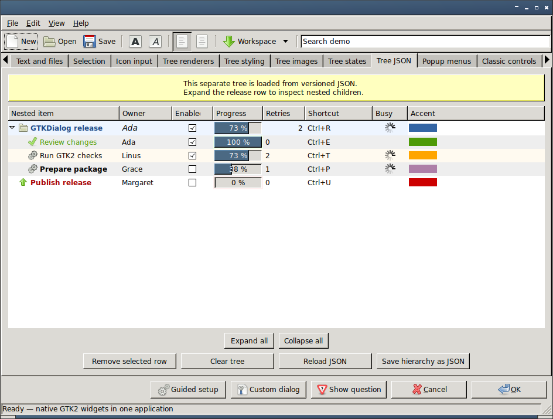

## Building

A normal build needs:

- a C compiler, `make` and `pkg-config`;
- the GTK+ 2 development files;
- the JSON-GLib 1.0 development files.

JSON-GLib is needed for the supported hierarchical JSON input and output of
the tree widget and should be installed for a complete build of this fork.
For compatibility with older systems, `configure` still permits a reduced
build without it; the historical pipe-separated tree format remains available
in that configuration.

VTE support is optional. It is enabled automatically when a GTK+ 2-compatible
libvte version 0.23.5 or later and its development files are present.

From a release archive, build outside the source directory:

```sh
mkdir build
cd build
../configure
make
make check
make install
```

Use the usual `DESTDIR` or `--prefix` options when packaging or installing to
a non-default location. Run `../configure --help` to see all configuration
options.

A Git checkout also needs Autoconf and Automake. Flex and Bison are needed
when regenerating the lexer or parser. Generate the build system first, then
use the same out-of-tree procedure:

```sh
NOCONFIGURE=1 ./autogen.sh
mkdir build
cd build
../configure
make
make check
```

The Texinfo manual is not built by default. Pass `--enable-texinfo` to
`configure` if `makeinfo` is available and the manual should be built and
installed.

## Running a dialog

An interface is normally exported as a shell variable and selected with
`--program`:

```sh
export MAIN_DIALOG='<window title="Hello">
  <vbox border-width="12" spacing="8">
    <text><label>GTKDialog is ready.</label></text>
    <button ok></button>
  </vbox>
</window>'

gtkdialog --program=MAIN_DIALOG
```

The complete language and widget index starts at
[`doc/reference/syntax.html`](doc/reference/syntax.html). Individual reference
pages describe attributes, directives, signals, functions and conditions.

## Current GTK2 extensions

The fork extends the original interface without changing the default meaning
of existing widget tags and data formats. Highlights include:

- hierarchical, versioned JSON trees alongside the original flat tree input;
- editable tree text, combo, toggle, radio, spin and accelerator cells;
- progress, spinner, icon, image, Pango markup and colour renderers, with
  optional row and cell styling;
- row-aware and keyboard-accessible popup menus, including a standalone
  desktop menu program;
- GTK2 layout and container tags including `grid`, paned windows, scrolled
  windows, explicit viewports, fixed positioning, drawing areas and large
  layout canvases;
- standalone scrollbars and measurement rulers, full embedded colour and font
  selectors, and a native hue/saturation/value selector;
- native accelerator labels bound to named menu items regardless of their XML
  order, plus lightweight directional arrow indicators;
- toolbars, detachable handle-box toolbars, tool palettes and their native
  GTK2 tool-item families;
- expanded file, recent-file and icon selection widgets, including native
  recent-resource submenus; notification-area status icons with reusable popup
  menus; native dialogs, optional VTE terminals and both sides of generic
  XEmbed embedding through sockets and plug roots.

<table>
  <tr>
    <th width="50%">Editable tree renderer</th>
    <th width="50%">Nested JSON tree</th>
  </tr>
  <tr>
    <td width="50%">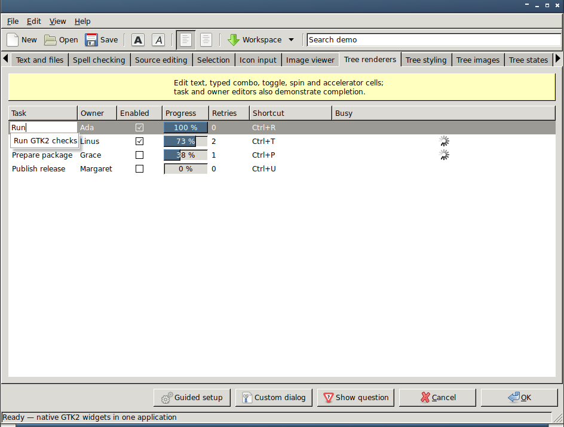</td>
    <td width="50%"></td>
  </tr>
  <tr>
    <th width="50%">Popup menus</th>
    <th width="50%">Toolbars and handle boxes</th>
  </tr>
  <tr>
    <td width="50%">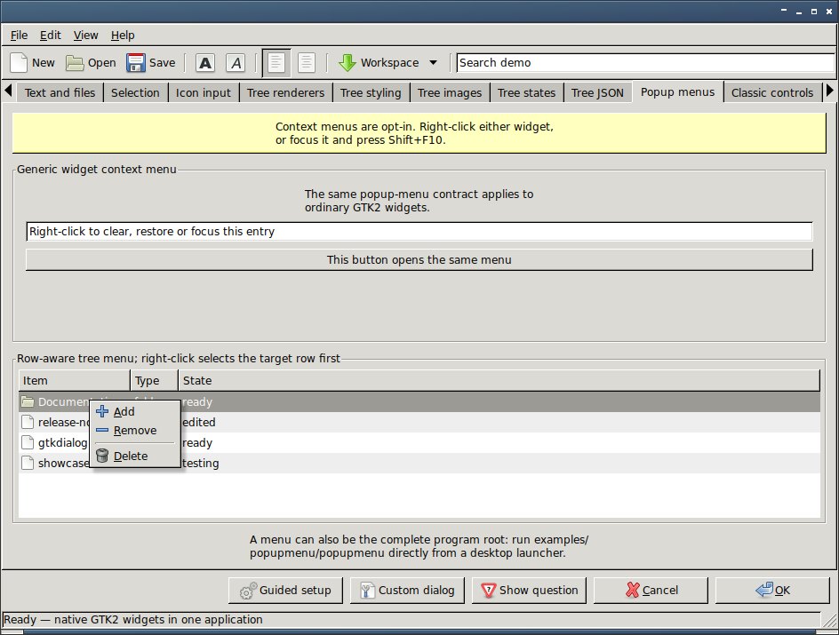</td>
    <td width="50%">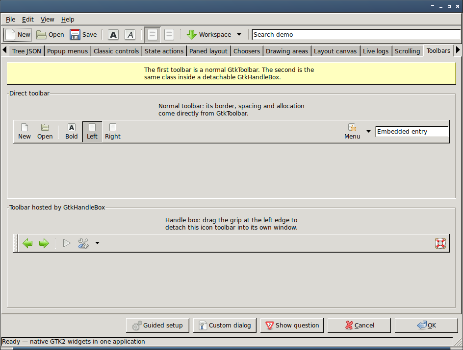</td>
  </tr>
  <tr>
    <th width="50%">Embedded terminal</th>
    <th width="50%">Generic XEmbed socket and plug</th>
  </tr>
  <tr>
    <td width="50%">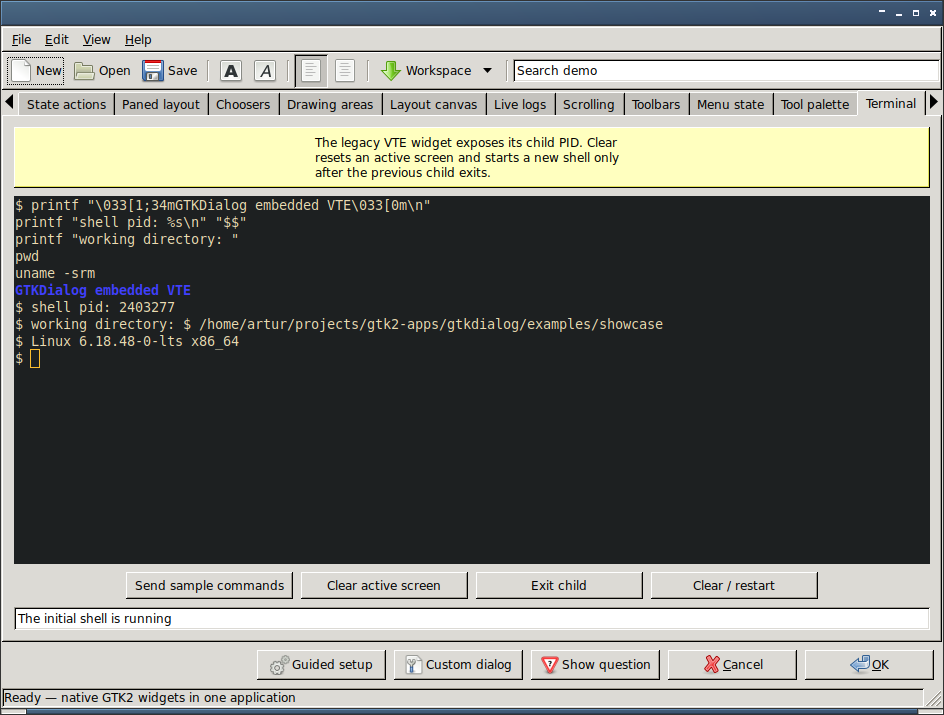</td>
    <td width="50%">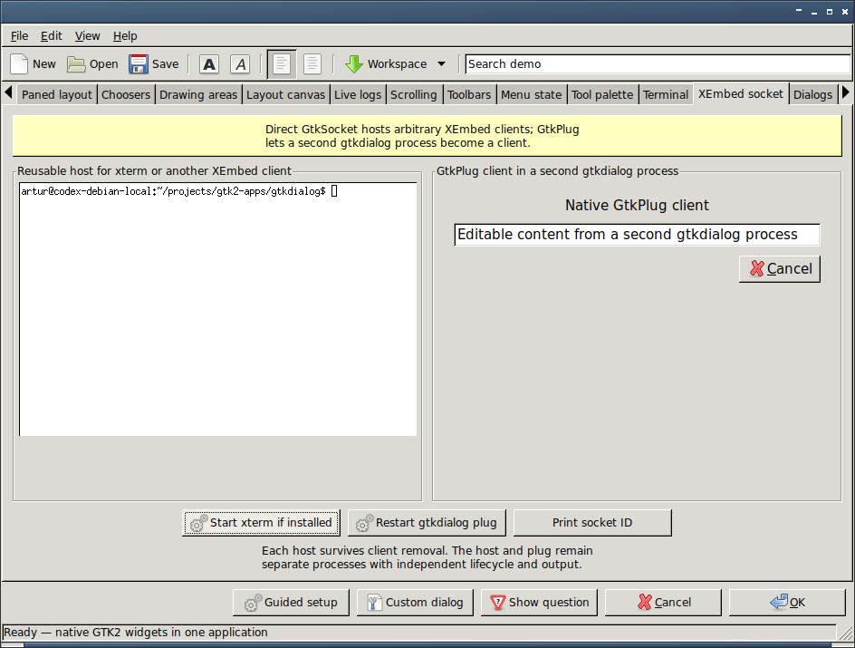</td>
  </tr>
  <tr>
    <th width="50%">Embedded colour selector</th>
    <th width="50%">Embedded font selector</th>
  </tr>
  <tr>
    <td width="50%">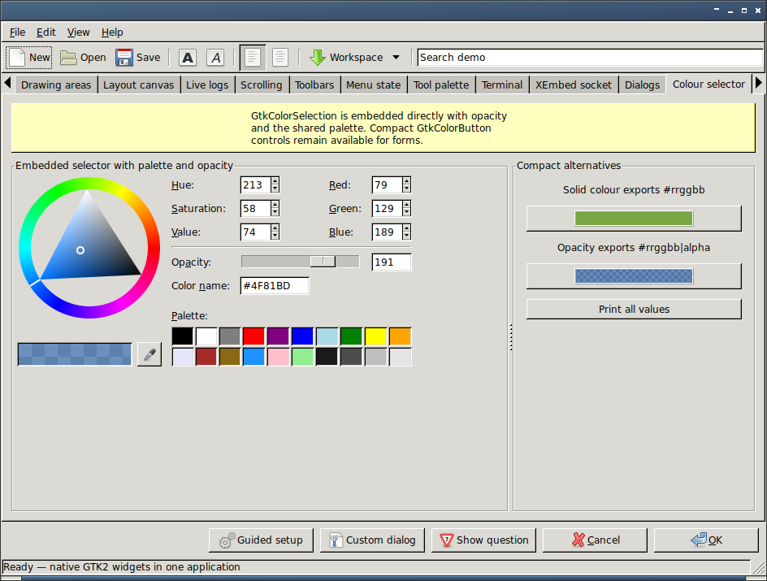</td>
    <td width="50%">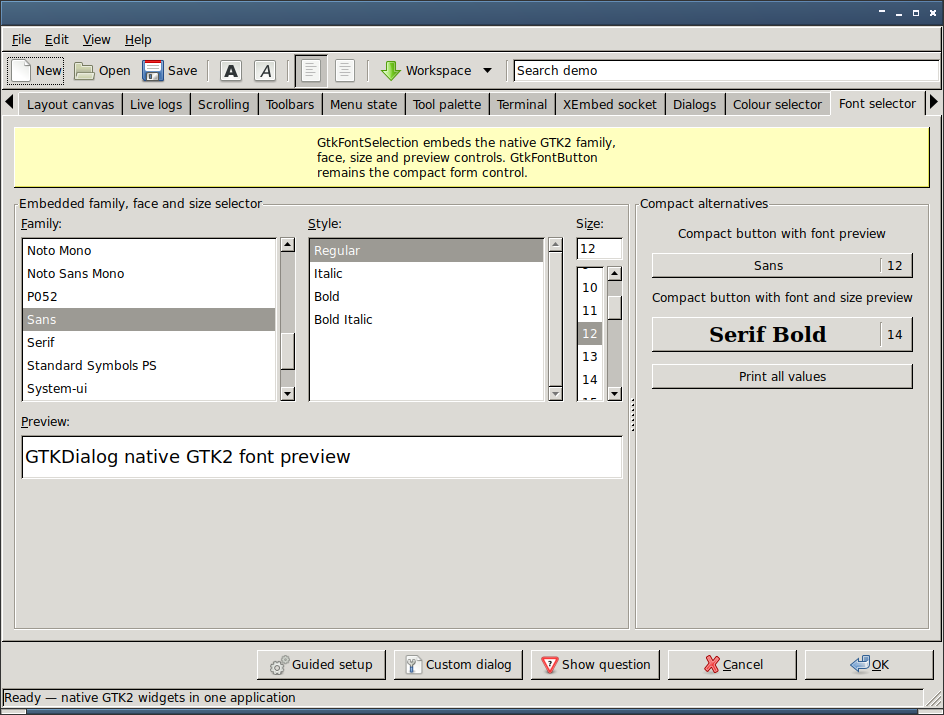</td>
  </tr>
  <tr>
    <th width="50%">Native HSV selector</th>
    <th width="50%">Drawing areas and rulers</th>
  </tr>
  <tr>
    <td width="50%">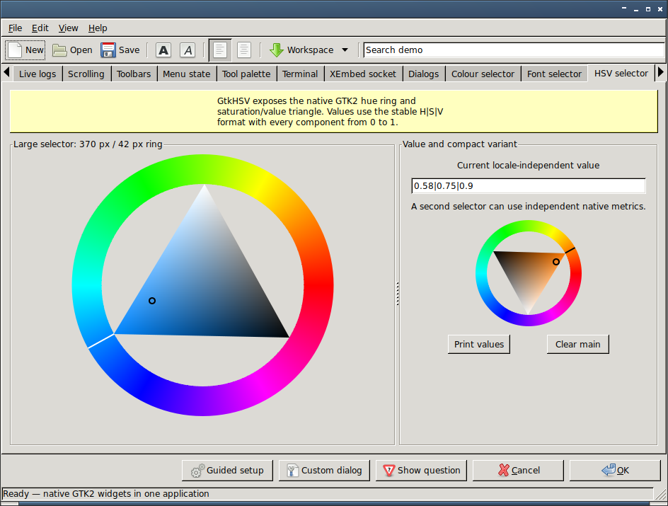</td>
    <td width="50%">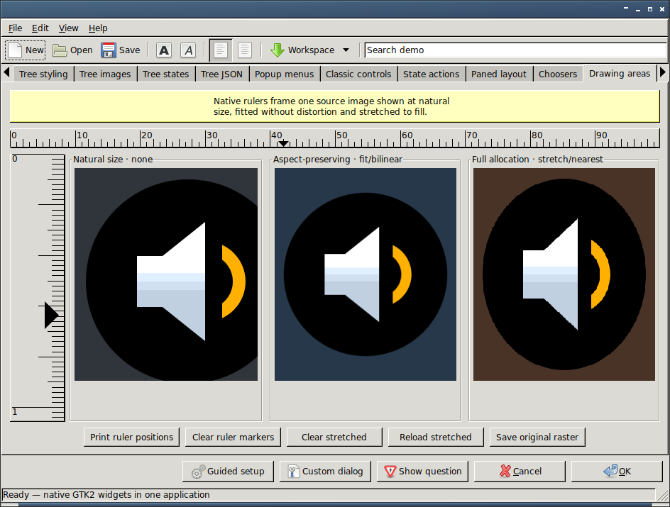</td>
  </tr>
  <tr>
    <th width="50%">Recent-resource menu</th>
    <th width="50%">Notification-area status icon and accelerator label</th>
  </tr>
  <tr>
    <td width="50%">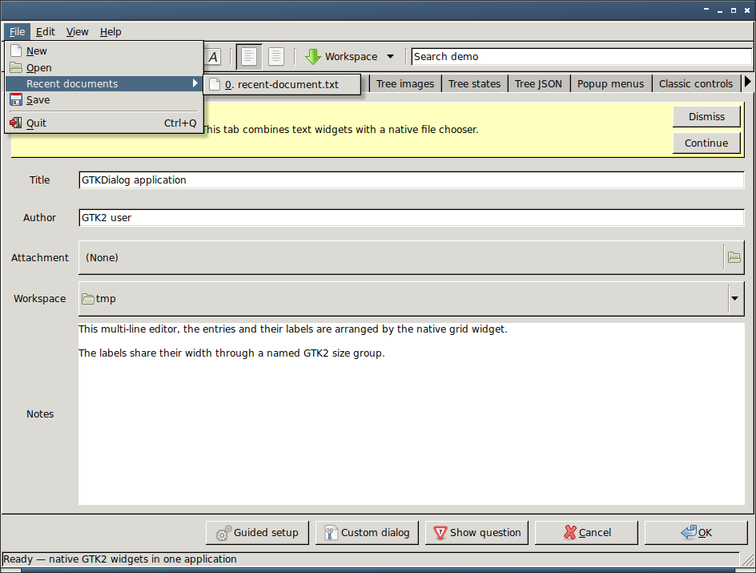</td>
    <td width="50%">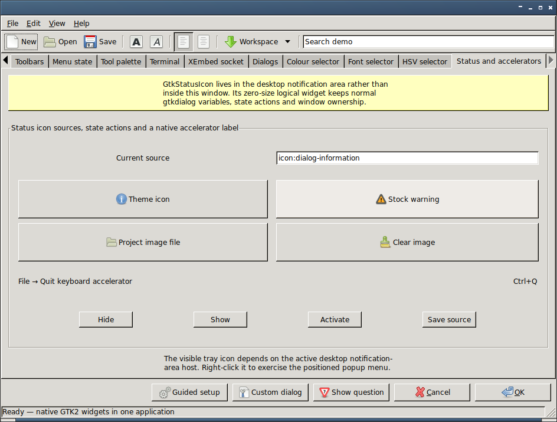</td>
  </tr>
</table>

Every showcase page is included in the
[`screenshots/` gallery](screenshots/README.md). To run the same interface with
a freshly built executable:

```sh
GTKDIALOG=/path/to/build/src/gtkdialog ./examples/showcase/showcase
```

## Compatibility

Existing 0.8.x XML interfaces, widget names and the flat tree format remain
supported. New behaviour that could reinterpret existing data is opt-in: for
example, hierarchical tree data requires `format="json"`, custom tree
renderers require `column-renderer`, and context menus require `context-menu`.

The parser stack and each container's widget list grow dynamically. There is
no architecture-specific widget-order workaround and no fixed per-container
widget limit.

## License and authors

GTKDialog is free software licensed under the GNU General Public License,
version 2 or, at your option, any later version (`GPL-2.0-or-later`). See
[`COPYING`](COPYING) for the complete GPL version 2 text. Some example icons
have separate copyright notices in the accompanying `COPYING-*` files.

See [`AUTHORS`](AUTHORS) for the original authors and contributors. This fork
is maintained by [Artur Bednarek](mailto:artur@unix.org.pl).

- [Current project](https://github.com/abednarek/gtkdialog)
- [Archived upstream](https://github.com/oshazard/gtkdialog)
