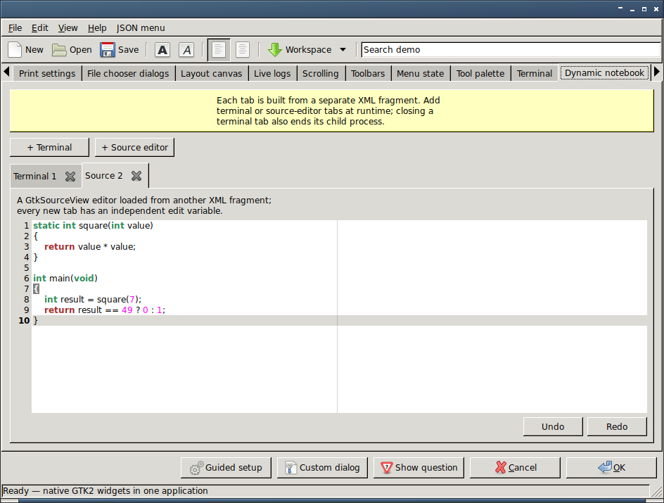
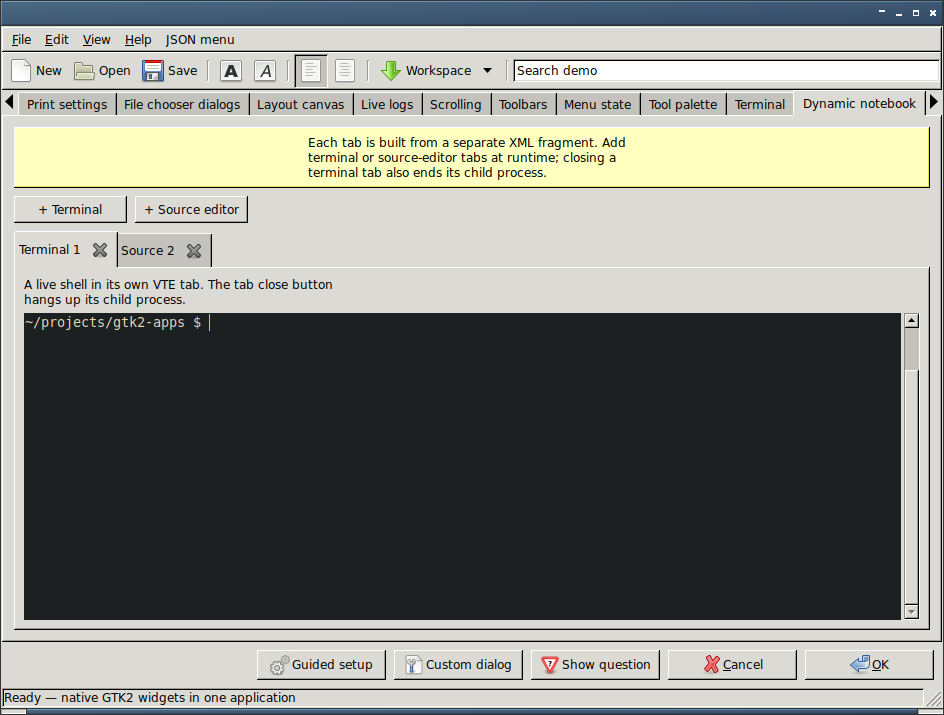

# GTKDialog

GTKDialog builds GTK+ 2 desktop interfaces from a compact XML-like
description. It is especially useful for shell scripts and other interpreted
programs that need a native graphical interface without a separately compiled
application.

This repository contains the maintained GTK+ 2 fork. It keeps the established
0.8.x interface available while adding GTK2 widgets and compatibility-minded
extensions. The current version is `0.9.2`; the project and source package
remain named `gtkdialog`, while the installed executable is `gdlg2` to avoid
colliding with other gtkdialog forks.


## Building

A normal build needs:

- a C compiler, `make` and `pkg-config`;
- the GTK+ 2.24.33 development files.

The default build contains the GTK2 core and does not enable external widget
libraries merely because they happen to be installed. Enable only the
integrations required by the intended installation:

| Configure option | Optional integration |
| --- | --- |
| `--with-json-glib` | JSON-GLib 1.0 hierarchical tree data and structured menu input |
| `--with-vte` | VTE 0.23.5 GTK2 terminal widget |
| `--with-gtkspell` | GtkSpell 2 inline spelling and correction menu |
| `--with-gtksourceview` | GtkSourceView 2 source editing and highlighting |
| `--with-gtkdatabox` | GtkDatabox 0.9 line, point and bar plots |
| `--with-gtksheet` | GtkSheet 3.5.1 editable spreadsheets |
| `--with-gdl` | GDL 2.30.1 rearrangeable docking areas |
| `--with-goocanvas` | GooCanvas 1.0 object scenes; also requires `--with-json-glib` |
| `--with-libwnck` | libwnck 2.30 task lists, pagers and window selectors |
| `--with-unix-print` | GTK2 Unix page-setup and print-settings dialogs |

`--enable-all-extensions` requests every integration. Individual
`--without-*` options can still exclude one from that complete set. An
explicitly requested integration is never silently omitted: `configure`
stops with an error if its development package is unavailable. Its final
summary records exactly which integrations will be compiled. Excluding
JSON-GLib from the complete set also disables its dependent GooCanvas
integration; a direct `--with-goocanvas` without `--with-json-glib` is an
error.

Dialogs remain parseable when most external integrations were not selected,
but the runtime fallback depends on the kind of extension:

| Requested feature in a build without it | Runtime behaviour |
| --- | --- |
| JSON tree input or output | Keep the ordinary tree and report that JSON-GLib is required |
| JSON menu or menubar input | Keep XML-defined items and report that JSON-GLib is required |
| VTE terminal | Display an explanatory label in place of the terminal |
| GtkSpell or GtkSourceView editing | Keep an ordinary `GtkTextView` and report a warning |
| GooCanvas or GtkDatabox drawing area | Display a blank drawing-area placeholder and report a warning |
| GtkSheet or libwnck widget | Display a diagnostic label and report a warning |
| GDL dock | Keep its children in labelled, non-rearrangeable GTK2 frames and report a warning |
| Unix page-setup or print dialog | Stop with a diagnostic because there is no equivalent top-level dialog |

These behaviours are part of the compatibility contract rather than a promise
that every unavailable widget has the same fallback. Portable scripts can use
`gdlg2 --version` to check the compiled feature list before requesting an
optional mode.

From a release archive, build outside the source directory:

```sh
mkdir build
cd build
../configure
make
make check
make install
```

For a complete build with every development package installed, replace the
configure command with:

```sh
../configure --enable-all-extensions
```

Use the usual `DESTDIR` or `--prefix` options when packaging or installing to
a non-default location. Run `../configure --help` to see all configuration
options.

APKBUILD, PKGBUILD and xbps-src recipes for this release are kept
[in the project repository](https://github.com/abednarek/gtkdialog/tree/main/packaging),
outside the generated source archive whose checksum they verify. The
`make dist` archive includes the pinned `bundled/` sources needed by the
private GTK2 and optional-extension package variants.

A Git checkout also needs Autoconf, Automake, Flex and Bison. The latter two
generate the lexer and parser during the build; release archives already
include those generated C sources. This public Git snapshot omits the test
suite; use the release archive for `make check`. Generate the build system
first, then use the same out-of-tree procedure:

```sh
NOCONFIGURE=1 ./autogen.sh
mkdir build
cd build
../configure
make
```

The Texinfo manual is not built by default. Pass `--enable-texinfo` to
`configure` if `makeinfo` is available and the manual should be built and
installed.

## Running a dialog

An interface is normally exported as a shell variable and selected with
`--program`:

```sh
export MAIN_DIALOG='<window title="Hello">
  <vbox border-width="12" spacing="8">
    <text><label>GTKDialog is ready.</label></text>
    <button ok></button>
  </vbox>
</window>'

gdlg2 --program=MAIN_DIALOG
```

The complete language and widget index starts at
[`doc/reference/syntax.html`](doc/reference/syntax.html). Individual reference
pages describe attributes, directives, signals, functions and conditions.

## Current GTK2 extensions

The fork extends the original interface without changing the default meaning
of existing widget tags and data formats. Highlights include:

- hierarchical, versioned JSON trees alongside the original flat tree input;
- versioned JSON files for nested menus and menubars, with icons, styled labels
  and actions alongside existing XML menu items;
- editable tree text, combo, toggle, radio, spin and accelerator cells, with
  static, command and monitored-file completion sources;
- progress, spinner, icon, image, Pango markup and colour renderers, with
  optional row and cell styling;
- row-aware and keyboard-accessible popup menus, including a standalone
  desktop menu program;
- scrolling text editors with bottom-following refreshes, optional GtkSpell 2
  inline checking and optional GtkSourceView 2 source-code editing with
  undo/redo actions;
- GTK2 layout and container tags including `grid`, paned windows, scrolled
  windows, explicit viewports, fixed positioning, drawing areas and large
  layout canvases;
- dynamic notebook tabs built from XML fragments, including mixed VTE terminal
  and GtkSourceView editor tabs with independent close actions;
- optional GtkDatabox 0.9 plots with multiple line, point and bar series,
  grids, numeric file input, selection and mouse or action-driven zooming;
- optional GooCanvas 1 object scenes with nested groups, shapes, paths, text,
  images, per-item styling, selection, dragging and JSON persistence;
- optional GtkSheet 3.5.1 spreadsheets with editable cells, configurable row
  and column headers, file input, refresh and data-file output;
- optional GDL 2 docking areas with named panels, relative placement,
  detachable content, switcher tabs and persistent layout files;
- optional libwnck 2 task lists with workspace-aware grouping, active-window
  values and window activation through normal input and refresh operations;
- optional libwnck 2 workspace pagers with content or name views, layout hints,
  active-workspace values and workspace activation through normal input;
- optional libwnck 2 window-selector menus with live application icons and
  titles, active-window XID values and activation through normal input;
- GTK2 2.20 off-screen program roots that render complete declarative widget
  trees to image files without placing a window on the desktop;
- native GTK2 Unix page-setup dialogs with paper, orientation and margin
  defaults plus reusable page-setup and print-settings files;
- native GTK2 Unix print dialogs that collect printer, range, copy and page
  choices as reusable settings without implicitly submitting a print job;
- native GTK2 file chooser dialog roots with open, save and folder modes,
  multiple path or URI selection, filters, shortcuts and response actions;
- standalone scrollbars and measurement rulers, full embedded colour and font
  selectors, a native hue/saturation/value selector, and an interactive
  transfer-curve editor with optional native gamma and mode controls;
- native accelerator labels bound to named menu items regardless of their XML
  order, plus lightweight directional arrow indicators;
- toolbars, detachable handle-box toolbars, tool palettes and their native
  GTK2 tool-item families;
- expanded file, recent-file and icon selection widgets, including native
  recent-resource submenus; notification-area status icons with reusable popup
  menus; native dialogs, optional VTE terminals and both sides of generic
  XEmbed embedding through sockets and plug roots.

<table>
  <tr>
    <th width="50%">Editable tree renderer</th>
    <th width="50%">Nested JSON tree</th>
  </tr>
  <tr>
    <td width="50%"></td>
    <td width="50%"></td>
  </tr>
  <tr>
    <th width="50%">Native image viewer modes</th>
    <th width="50%">Optional GtkSpell integration</th>
  </tr>
  <tr>
    <td width="50%"></td>
    <td width="50%"></td>
  </tr>
  <tr>
    <th width="50%">Optional source-code editors</th>
    <th width="50%">Native dialogs</th>
  </tr>
  <tr>
    <td width="50%"></td>
    <td width="50%"></td>
  </tr>
  <tr>
    <th width="50%">Popup menus</th>
    <th width="50%">Toolbars and handle boxes</th>
  </tr>
  <tr>
    <td width="50%"></td>
    <td width="50%"></td>
  </tr>
  <tr>
    <th width="50%">Embedded terminal</th>
    <th width="50%">Generic XEmbed socket and plug</th>
  </tr>
  <tr>
    <td width="50%"></td>
    <td width="50%"></td>
  </tr>
  <tr>
    <th width="50%">Dynamic notebook: source editor</th>
    <th width="50%">Dynamic notebook: terminal</th>
  </tr>
  <tr>
    <td width="50%"></td>
    <td width="50%"></td>
  </tr>
  <tr>
    <th width="50%">Embedded colour selector</th>
    <th width="50%">Embedded font selector</th>
  </tr>
  <tr>
    <td width="50%"></td>
    <td width="50%"></td>
  </tr>
  <tr>
    <th width="50%">Native HSV selector</th>
    <th width="50%">Transfer curves with native controls</th>
  </tr>
  <tr>
    <td width="50%"></td>
    <td width="50%"></td>
  </tr>
  <tr>
    <th width="50%">Detachable recent-resource menu</th>
    <th width="50%">Notification-area status icon and accelerator label</th>
  </tr>
  <tr>
    <td width="50%"></td>
    <td width="50%"></td>
  </tr>
  <tr>
    <th width="50%">Optional numeric plots</th>
    <th width="50%">Optional editable spreadsheets</th>
  </tr>
  <tr>
    <td width="50%"></td>
    <td width="50%"></td>
  </tr>
  <tr>
    <th width="50%">Optional rearrangeable docking workspace</th>
    <th width="50%">Optional interactive object scenes</th>
  </tr>
  <tr>
    <td width="50%"></td>
    <td width="50%"></td>
  </tr>
  <tr>
    <th width="50%">Optional native desktop task lists</th>
    <th width="50%">Optional native workspace pagers</th>
  </tr>
  <tr>
    <td width="50%"></td>
    <td width="50%"></td>
  </tr>
  <tr>
    <th width="50%">Optional native window-selector menu</th>
    <th width="50%">GTK2 off-screen rendering</th>
  </tr>
  <tr>
    <td width="50%"></td>
    <td width="50%"></td>
  </tr>
  <tr>
    <th width="50%">Native GTK2 Unix page setup</th>
    <th width="50%">Native GTK2 Unix print settings</th>
  </tr>
  <tr>
    <td width="50%"></td>
    <td width="50%"></td>
  </tr>
  <tr>
    <th colspan="2">Native GTK2 file chooser dialogs</th>
  </tr>
  <tr>
    <td colspan="2" align="center"></td>
  </tr>
</table>

Every showcase page is included in the
[`screenshots/` gallery](screenshots/README.md). To run the same interface with
a freshly built executable:

```sh
GTKDIALOG=/path/to/build/src/gdlg2 ./examples/showcase/showcase
```

## Compatibility

Existing 0.8.x XML interfaces, widget names and the flat tree format remain
supported. New behaviour that could reinterpret existing data is opt-in: for
example, hierarchical tree data and structured menus require
`format="json"`, custom tree renderers require `column-renderer`, and
context menus require `context-menu`.

The parser stack and each container's widget list grow dynamically. There is
no architecture-specific widget-order workaround and no fixed per-container
widget limit.

## License and authors

GTKDialog is free software licensed under the GNU General Public License,
version 2 or, at your option, any later version (`GPL-2.0-or-later`). See
[`COPYING`](COPYING) for the complete GPL version 2 text. Some example icons
have separate copyright notices in the accompanying `COPYING-*` files.

See [`AUTHORS`](AUTHORS) for the original authors and contributors. This fork
is maintained by [Artur Bednarek](mailto:artur@unix.org.pl).

- [Current project](https://github.com/abednarek/gtkdialog)
- [Archived upstream](https://github.com/oshazard/gtkdialog)
